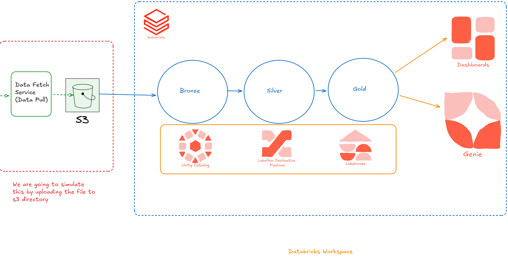

#  Databricks Lakehouse End-to-End Data Pipeline

## Overview

This project demonstrates an **end-to-end data engineering pipeline** built on the **Databricks Lakehouse Platform** using:

* ⚡ Apache Spark
* ☁️ Databricks Auto Loader (`cloudFiles`)
* 🔁 Lakeflow Declarative Pipelines
* 🧱 Medallion Architecture (Bronze → Silver → Gold)
* 📊 Incremental & Full Load Processing
* 🔄 Upserts & Auto CDC handling
* 🔐 Unity Catalog for governance

The pipeline simulates real-world data ingestion from **Amazon S3**, processes it through multiple layers, and produces **BI-ready datasets**.

---

##  Architecture

* Data is ingested from S3
* Processed through Bronze, Silver, Gold layers
* Served to dashboards and analytics tools

---

## 🔄 Data Flow

1. 📥 Data fetched and stored in S3
2. ⚡ Auto Loader ingests data into Bronze layer
3. 🧹 Data cleaned and transformed in Silver layer
4. 🥇 Aggregated and business-ready data in Gold layer
5. 📊 Consumed by dashboards / BI tools

---

## 🧱 Medallion Architecture

### 🟤 Bronze Layer

* Raw data ingestion
* Schema inference using Auto Loader
* Metadata tracking (file name, ingestion timestamp)

### ⚪ Silver Layer

* Data cleaning and transformation
* Deduplication
* Business logic applied
* CDC and upsert logic implemented

### 🟡 Gold Layer

* Aggregated datasets
* BI-ready tables
* Optimized for reporting and analytics

---

## ⚙️ Key Features

* ✅ Auto Loader (`cloudFiles`) for scalable ingestion
* ✅ Incremental Load Processing
* ✅ Full Load Handling
* ✅ Upsert (MERGE) Logic
* ✅ Auto CDC (Change Data Capture)
* ✅ Schema Evolution Support
* ✅ Metadata Tracking
* ✅ Unity Catalog Integration
* ✅ Access Control & Governance

---

## 📂 Project Structure

```
├── data/
│   └── (sample or source data files)
│
├── code/
│   ├── project-setup/
│   │   ├── catalog_schema_setup.py
│   │   ├── s3_connection_setup.py
│   │
│   ├── bronze/
│   │   ├── trips_bronze.py
│   │   ├── city_bronze.py
│   │
│   ├── silver/
│   │   ├── trips_silver.py
│   │   ├── city_silver.py
│   │   ├── calendar_silver.py
│   │
│   ├── gold/
│   │   ├── trips_gold.py
│   │   ├── bi_aggregations.py
```

---

## 🛠️ Technologies Used

* Apache Spark (PySpark)
* Databricks Lakehouse
* Auto Loader (`cloudFiles`)
* Delta Lake
* Lakeflow Declarative Pipelines
* Unity Catalog
* Amazon S3

---

## 📊 Pipeline Highlights

### 🔹 Incremental Load

* Only new data is processed
* Improves performance and reduces cost

### 🔹 Full Load

* Supports complete reload when needed

### 🔹 Upsert Logic

* Uses `MERGE INTO` for handling updates and inserts

### 🔹 Auto CDC

* Automatically detects changes in data
* Maintains latest state of records

---

## 🔐 Data Governance

* Unity Catalog used for:

  * Access control
  * Data lineage
  * Centralized metadata management

---

## 🚀 How to Run

### 1️⃣ Setup Environment

* Create Databricks workspace
* Configure Unity Catalog
* Connect S3 bucket

---

### 2️⃣ Run Setup Scripts

```bash
code/project-setup/
```

---

### 3️⃣ Start Bronze Pipeline

```bash
code/bronze/
```

---

### 4️⃣ Run Silver Transformations

```bash
code/silver/
```

---

### 5️⃣ Generate Gold Layer

```bash
code/gold/
```

---

## 📈 Output

* Cleaned and structured datasets
* Aggregated business-level insights
* Ready for dashboards and analytics

---

## 🎯 Learning Outcomes

This project covers:

* End-to-end data pipeline design
* Declarative vs Imperative pipelines
* Real-time ingestion with Auto Loader
* Data modeling using Medallion Architecture
* Incremental vs Full load strategies
* CDC & Upsert implementation
* Data governance with Unity Catalog

---

## 🤝 Contribution

Feel free to fork this repo and improve the pipeline!

---

## ⭐ If you found this useful, give it a star!
